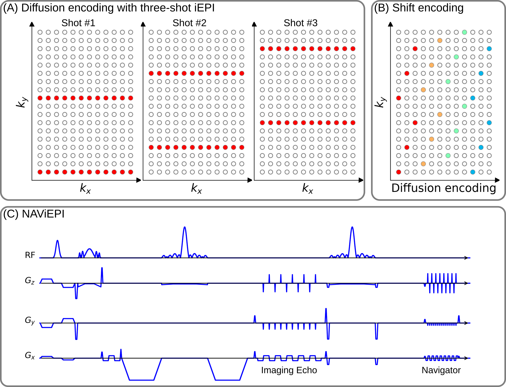

# ISMRM 2024

## Accelerated Diffusion-Weighted MRI at 7T: Joint Reconstruction for Shift-Encoded Navigated Interleaved Echo Planar Imaging (JETS-NAViEPI)

Zhengguo Tan, Patrick Liebig, Robin Heidemann, Frederik Laun, Florian Knoll

### Full Synopsis (100 words) and Impact (40 words)

**Background**: Diffusion-weighted MRI suffers from limited spatial resolution, residual geometric distortion, and long acquisition.
**Goal**: To develop high spatial-angular-temporal resolution DW-MRI at 7T.
**Approach**: We developed ky-shift encoding and navigated interleaved EPI (NAViEPI) with consistent echo spacing, enabling efficient sampling and minimal distortion mismatch between echoes. We developed joint reconstruction with locally low-rank regularization, encompassing multi-band slices and multiple diffusion directions.
**Results**: We achieved (1) whole brain 3-scan trace acquisition at a resolution of $0.5 \times 0.5 \times 2.0$ mm $^3$ and 98 seconds, and (2) 3-shell 126 diffusion encodings with $1.0$ mm isotropic resolution and 22 minutes scan time.
**Impact: JETS-NAViEPI enables accelerated submillimeter resolution in vivo brain DW-MRI at 7T, offering both clinically relevant 3-scan trace and neuroscientific DTI protocols.**

(main abstract: 750 words)

### Background or Purpose

Diffusion-weighted MRI (DW-MRI) [1,2] is a non-invasive imaging modality sensitive to the intravoxel Brownian motion of water molecules. It has been widely used in acute brain ischemia diagnosis, tumor detection and staging, and neuroscience [3]. However, despite wide spectrums of technique advances, including single-shot echo-planar imaging (SS-EPI) [4], simultaneous multi-slice (SMS) [5,6], gSlider [7], and TOPUP [8], DW-MRI still suffers from limited spatial resolution, residual geometric distortion, and long acquisition. In this work, we aim to develop high spatial-angular-temporal resolution DW-MRI at 7T.

### Methods

#### JETS-NAViEPI

> **Figure 1**. (A) An example DW-MRI acquisition with three-shot iEPI. (B) The proposed ky shifted diffusion encoding scheme. This example employs three shots per DWI, so every three columns have the same color. (C) NAViEPI: navigated iEPI with consistent effective echo spacing, where iEPI meets rsEPI. SMS is utilized for the acquisition of both imaging and navigator echoes.

> **Figure 2**. The forward operator in our joint k-q-slice reconstruction. The indices 'x' and 'y' denote the image size, 'z' denotes the multi-band slices, 'q' denotes the diffusion encoding, 's' denotes the shots, and 'c' denotes the coil sensitivities.

Figure 1 displays the proposed $k_y$-shifted NAViEPI sequence. Firstly, the interleaved EPI sampling pattern is shifted by one $k_y$ line per diffusion direction, with the cycling period being the in-plane undersampling factor. This allows for complementary k-q-space sampling. Second, as inspired by readout-segmented EPI (rsEPI) [9], NAViEPI enforces consistent effective echo spacing between imaging and navigator echoes, enabling (1) minimal geometric distortion mismatch between echoes, and (2) accelerated acquisition and a flexible number of shots with reliable shot-to-shot phase estimation from navigators.

Figure 2 illustrates the construction of the forward operator in joint reconstruction. Shot phases were estimated from navigators via SMS parallel imaging and then fed into the forward operator, based on which locally low-rank regularization [10] is employed in the spatial-diffusion dimension. All source codes are publicly available on https://github.com/ZhengguoTan/sigpy and https://github.com/ZhengguoTan/demo_jets_diffusion_mri_7t.

#### Experiments

**Experiment #1**. To validate the effectiveness of the proposed joint reconstruction, 4-shot iEPI with fully-sampled in-plane acquisition and a multi-band factor of 3 was used to acquire DWI with 20 diffusion directions at the b-value of 1000 s/mm2 and 1 mm isotropic resolution. The data was reconstructed via MUSE [11], MUSE with the local PCA denoiser [12], JULEP [13], and our proposed method, respectively.

**Experiment #2**. To demonstrate the sampling efficiency of NAViEPI, 5-shot NAViEPI with three-fold in-plane undersampling and a multi-band factor of 2 was used for the 3-scan trace acquisition at 0.5 mm in-plane resolution and a slice thickness of 2 mm. Single-shot EPI with the same acceleration as NAViEPI was also acquired for comparison. For a total of 60 slices, NAViEPI took 98 seconds, whereas single-shot EPI took 46 seconds.

**Experiment #3**. Three-shell DWI was acquired with 20, 30, 64 directions at the b-value of 1000, 2000, 3000 s/mm2, respectively. 2-shot iEPI was used with three-fold in-plane undersampling and a multi-band factor of 3, yielding a total scan time of 22 minutes.

All experiments employed 6/8 partial Fourier. In vivo measurements were conducted at 7T (Terra, Siemens Healthineers, Erlangen, Germany) with a 32-channel head coil (Nova Medical) and the XR-gradient system (80 mT/m @ 200 T/m/s).

### Results

> **Figure 3**. Reconstructed DW images (the 8th diffusion encoding) based on 4-shot iEPI acquisition with 1 mm isotropic resolution. Four reconstruction methods are compared (from left to right): JETS, MUSE, MUSE with denoiser, and JULEP. The 2nd row displays the magnified views of the yellow square. The image from the denoiser (3rd column) shows residual noise patterns within the globus pallidus  (indicated by the red arrow). The JULEP reconstruction (4th column) shows signal dropout in the central region (indicated by the red arrow).

Figure 3 displays the results from Experiment #1. The residual noise from MUSE can be largely removed by the denoiser. However, when compared to JETS, the denoiser shows residual noise patterns within the globus pallidus (indicated by the red arrow). JETS also shows better denoising than JULEP. The reason is that JETS enforces spatial-diffusion regularization, whereas JULEP formulates structured low-rank regularization of the four shots for one diffusion encoding.

> **Figure 4**. Sampling efficiency of the proposed NAViEPI sequence. 5-shot NAViEPI acquisition with the voxel size $0.5\times0.5\times2.0$~mm $^3$ was compared with single-shot EPI acquisition. Both the 1st and the 2nd columns were reconstructed via parallel imaging without LLR regularization, whereas the 3rd column was reconstructed via JETS.

As shown in Figure 4, NAViEPI achieves sub-millimeter resolution (voxel size $0.5\times0.5\times2.0$ mm $^3$) with the use of a 5-shot acquisition. When compared to a single-shot acquisition with the same voxel size, the acquisition time of NAViEPI is about two times longer, but the image quality of NAViEPI is remarkably improved.

In the sub-millimeter imaging scenario, the increased base resolution requires longer TE (143 ms) in the single-shot acquisition, which results in significant signal loss due to T2 relaxation. Therefore, sub-millimeter DWI necessitates multi-shot acquisition, which is subject to shot-to-shot phase variation and long scan time. However, NAViEPI solves both challenges. The 5-shot acquisition reduces TE to 58 ms, and thus retains SNR significantly compared to the single-shot acquisition. Moreover, the JETS reconstruction can help to reduce noise and improve structural visibility.

> **Figure 5**. Comparison of three-shell DWIs and cFA maps. Reconstruction methods from top to bottom were MUSE, MUSE with the local-PCA denoiser, and the proposed JETS method.

Experiment #3 yields an acceleration factor of $6 \times 3$ per shot, resulting in severe noise amplification in MUSE reconstructed DWIs, as shown in Figure 5. Here, a slice that highlights the corpus callosum is displayed, and the diffusion direction at the b-value of 3000 s/mm^2 with bright signals within the corpus callosum is shown. The local-PCA denoiser substantially removes noise, but the DWI at high b-values still illustrates more noise, compared to the proposed JETS reconstruction.

### Conclusions

We demonstrated the JETS-NAViEPI technique, which integrates a ky-shifted encoding navigator-based interleaved EPI sequence and joint reconstruction with overlapping locally low-rank regularization for high spatial-angular-temporal resolution DW-MRI at 7T. This technique allows for high-quality DW image reconstruction with accelerated acquisitions.

### References

[1] Le Bihan D, Breton E, Lallemand D, Grenier P, Cabanis E, Laval-Jeantet M. MR imaging of intravoxel incoherent motions: application to diffusion and perfusion in neurologic disorders. Radiology 1986;161:401-407. doi: 10.1148/radiology.161.2.3763909.

[2] Merboldt KD, Hanicke W, Frahm J. Self-diffusion NMR imaging using stimulated echoes. J Magn Reson 1985;64:479-486. doi: 10.1016/0022-2364(85)90111-8.

[3] Jones DK. Diffusion MRI: theory, methods, and applications. Oxford University Press 2010. doi: 10.1093/med/9780195369779.001.0001.

[4] Mansfield P. Multi-planar image formation using NMR spin echoes. J Phys C 1977;10:55-58. doi: 10.1088/0022-3719/10/3/004.

[5] Breuer FA, Blaimer M, Heidemann RM, Mueller MF, Griswold MA, Jakob PM. Controlled aliasing in parallel imaging results in higher acceleration (CAIPIRINHA) for multi-slice imaging. Magn Reson Med 2005;53:684-691. doi: 10.1002/mrm.20401.

[6] Setsompop K, Gagoski BA, Polimeni JR, Witzel T, Wedeen VJ, Wald LL. Blipped-controlled aliasing in parallel imaging for simultaneous multislice echo planar imaging with reduced g-factor penalty. Magn Reson Med 2012;67:1210-1224. doi: 10.1002/mrm.23097.

[7] Setsompop K, et al. High-resolution in vivo diffusion imaging of the human brain with generalized slice dithered enhanced resolution: Simultaneous multislice (gSlider-SMS). Magn Reson Med 2012;79:141-151. doi: 10.1002/mrm.26653.

[8] Andersson JLR, Skare S, Ashburner J. How to correct susceptibility distortions in spin-echo echo-planar images: application to diffusion tensor imaging. NeuroImage 2003;20:870-888. doi: 10.1016/S1053-8119(03)00336-7.

[9] Porter DA, Heidemann RM. High resolution diffusion-weighted imaging using readout-segmented echo-planar imaging, parallel imaging and a two-dimensional navigator-based reacquisition. Magn Reson Med 2009;62:468-475. doi: 10.1002/mrm.22024.

[10] Zhang T, Pauly JM, Levesque IR. Accelerated parameter mapping with a locally low rank constraint. Magn Reson Med 2015;73:655-661. doi: 10.1002/mrm.25161.

[11] Chen NK, Guidon A, Chang HC, Song AW. A robust multi-shot scan strategy for high-resolution diffusion weighted MRI enabled by multiplexed sensitivity-encoding (MUSE). NeuroImage 2013;72:41-47. doi: 10.1016/j.neuroimage.2013.01.038.

[12] Cordero-Grande L, Christiaens D, Hutter J, Price AN, Hajnal JV. Complex diffusion-weighted image estimation via matrix recovery under general noise models. NeuroImage 2019;200:391-404. doi: 10.1016/j.neuroimage.2019.06.039.

[13] Dai E, Mani M, McNab JA. Multi-band multi-shot diffusion MRI reconstruction with joint usage of structured low-rank constraints and explicit phase mapping. Magn Reson Med 2023;89:95-111. doi: 10.1002/mrm.29422.
